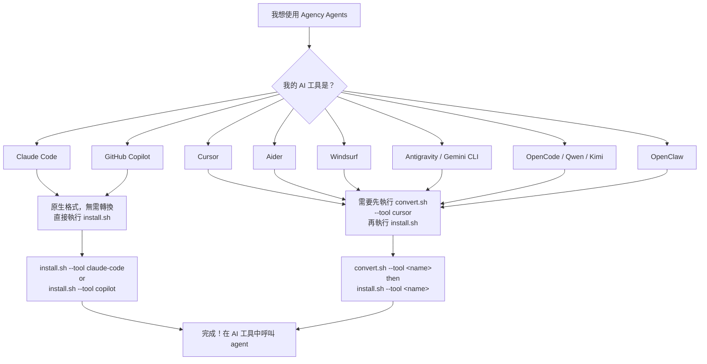

# API_SURFACE.md — API 與介面參考文件

> **The Agency** 沒有 HTTP API。本文件涵蓋三類「公開介面」：
> 1. Bash CLI 腳本命令介面（`convert.sh`、`install.sh`、`lint-agents.sh`）
> 2. Agent Frontmatter Schema（agent 定義的資料結構規範）
> 3. 各 AI 工具的 agent 呼叫方式（用戶端整合 API）

---

## 目錄

1. [工具選擇決策樹](#工具選擇決策樹)
2. [scripts/convert.sh](#scriptsconvertsh)
3. [scripts/install.sh](#scriptsinstallsh)
4. [scripts/lint-agents.sh](#scriptslint-agentssh)
5. [Agent Frontmatter Schema](#agent-frontmatter-schema)
6. [各 AI 工具的 Agent 呼叫方式](#各-ai-工具的-agent-呼叫方式)
7. [Lint 錯誤代碼與訊息](#lint-錯誤代碼與訊息)
8. [退出碼（Exit Codes）](#退出碼exit-codes)

---

## 工具選擇決策樹



---

## scripts/convert.sh

**檔案路徑**: `scripts/convert.sh`
**用途**: 將 `.md` agent 檔案轉換為各 AI 工具的特定格式，輸出到 `integrations/<tool>/`

### Synopsis

```bash
./scripts/convert.sh [--tool <name>] [--out <dir>] [--parallel] [--jobs N] [--help]
```

### 選項

| 選項 | 型別 | 預設值 | 說明 |
|------|------|--------|------|
| `--tool <name>` | string | `all` | 指定要轉換的工具，`all` 表示全部工具 |
| `--out <dir>` | path | `integrations/` | 覆蓋輸出目錄（相對於 repo 根目錄） |
| `--parallel` | flag | false | 啟用並行模式（僅在 `--tool all` 時有效） |
| `--jobs N` | integer | `nproc` 或 4 | 並行時的最大工作數 |
| `--help` / `-h` | flag | — | 顯示使用說明並退出 |

### 有效工具名稱（`--tool` 的合法值）

| 工具名稱 | 輸出格式 | 輸出路徑 |
|----------|----------|----------|
| `antigravity` | `SKILL.md` per agent | `integrations/antigravity/agency-<slug>/` |
| `gemini-cli` | `SKILL.md` + `gemini-extension.json` | `integrations/gemini-cli/skills/<slug>/` |
| `opencode` | `.md` with `mode: subagent` | `integrations/opencode/agents/<slug>.md` |
| `cursor` | `.mdc` rule files | `integrations/cursor/rules/<slug>.mdc` |
| `aider` | 單一 `CONVENTIONS.md` | `integrations/aider/CONVENTIONS.md` |
| `windsurf` | 單一 `.windsurfrules` | `integrations/windsurf/.windsurfrules` |
| `openclaw` | `SOUL.md` + `AGENTS.md` + `IDENTITY.md` | `integrations/openclaw/<slug>/` |
| `qwen` | `.md` SubAgent files | `integrations/qwen/agents/<slug>.md` |
| `kimi` | `agent.yaml` + `system.md` | `integrations/kimi/<slug>/` |
| `all` | 所有上述格式 | 所有上述路徑 |

### 使用範例

```bash
# 轉換所有工具（預設）
./scripts/convert.sh

# 只轉換 Cursor 格式
./scripts/convert.sh --tool cursor

# 只轉換 Kimi 格式
./scripts/convert.sh --tool kimi

# 並行模式轉換所有工具（加速）
./scripts/convert.sh --parallel

# 限制並行數量為 2
./scripts/convert.sh --parallel --jobs 2

# 指定自訂輸出目錄
./scripts/convert.sh --out /tmp/my-integrations

# 只轉換 Gemini CLI 格式到自訂目錄
./scripts/convert.sh --tool gemini-cli --out /tmp/output
```

### 注意事項

- 此腳本**不會**修改任何用戶 config 目錄（只寫入 `integrations/`）
- Aider 和 Windsurf 採用 accumulation 模式：所有 agents 累積後才寫出單一檔案
- 並行模式下，`antigravity`、`gemini-cli`、`opencode`、`cursor`、`openclaw`、`qwen` 並行執行；`aider` 和 `windsurf` 仍需序列執行
- 環境變數 `NO_COLOR=1` 可停用彩色輸出
- 參考行號：`scripts/convert.sh:522–639`（`main()` 函式）

---

## scripts/install.sh

**檔案路徑**: `scripts/install.sh`
**用途**: 將 `integrations/` 中的轉換後檔案安裝到各 AI 工具的 config 目錄

### Synopsis

```bash
./scripts/install.sh [--tool <name>] [--interactive] [--no-interactive] [--parallel] [--jobs N] [--help]
```

### 選項

| 選項 | 型別 | 預設值 | 說明 |
|------|------|--------|------|
| `--tool <name>` | string | `all` | 安裝指定工具，隱含 `--no-interactive` |
| `--interactive` | flag | 終端機下自動啟用 | 顯示互動式 checkbox 選單 |
| `--no-interactive` | flag | CI 環境下自動啟用 | 跳過選單，自動偵測並安裝 |
| `--parallel` | flag | false | 並行安裝多個工具 |
| `--jobs N` | integer | `nproc` 或 4 | 並行時的最大工作數 |
| `--help` / `-h` | flag | — | 顯示使用說明並退出 |

### 安裝目標（`--tool` 的合法值）

| 工具名稱 | 安裝路徑 | 偵測方式 |
|----------|----------|----------|
| `claude-code` | `~/.claude/agents/` | `[[ -d ~/.claude ]]` |
| `copilot` | `~/.github/agents/` 和 `~/.copilot/agents/` | `command -v code` 或 `~/.github` 或 `~/.copilot` |
| `antigravity` | `~/.gemini/antigravity/skills/` | `[[ -d ~/.gemini/antigravity/skills ]]` |
| `gemini-cli` | `~/.gemini/extensions/agency-agents/` | `command -v gemini` 或 `[[ -d ~/.gemini ]]` |
| `opencode` | `.opencode/agents/`（目前目錄） | `command -v opencode` 或 `~/.config/opencode` |
| `cursor` | `.cursor/rules/`（目前目錄） | `command -v cursor` 或 `[[ -d ~/.cursor ]]` |
| `aider` | `./CONVENTIONS.md`（目前目錄） | `command -v aider` |
| `windsurf` | `./.windsurfrules`（目前目錄） | `command -v windsurf` 或 `~/.codeium` |
| `openclaw` | `~/.openclaw/agency-agents/` | `command -v openclaw` 或 `[[ -d ~/.openclaw ]]` |
| `qwen` | `~/.qwen/agents/`（user-wide）或 `.qwen/agents/`（project） | `command -v qwen` 或 `[[ -d ~/.qwen ]]` |
| `kimi` | `~/.config/kimi/agents/` | `command -v kimi` |
| `all` | 偵測到的所有工具 | 同上 |

### 使用範例

```bash
# 互動模式（終端機下自動）
./scripts/install.sh

# 安裝指定工具（跳過互動選單）
./scripts/install.sh --tool claude-code
./scripts/install.sh --tool cursor

# CI / 非互動模式（自動偵測所有已安裝工具）
./scripts/install.sh --no-interactive

# 強制互動模式
./scripts/install.sh --interactive

# 並行安裝
./scripts/install.sh --no-interactive --parallel

# 並行安裝，限制工作數
./scripts/install.sh --no-interactive --parallel --jobs 4
```

### 前置條件

執行 `install.sh` 前，`integrations/` 目錄必須存在（由 `convert.sh` 生成）。若目錄不存在，腳本會輸出 error 並退出。

```bash
# 標準工作流程
./scripts/convert.sh && ./scripts/install.sh
```

### 注意事項

- Claude Code 和 GitHub Copilot 是原生格式，不需先執行 `convert.sh`
- `cursor`、`opencode`、`aider`、`windsurf` 安裝到**目前工作目錄**，需在專案根目錄執行
- `openclaw` 安裝後需執行 `openclaw gateway restart` 才能啟用
- Windsurf / Aider 重複安裝時會顯示 warn 並跳過（不覆蓋現有檔案）
- 參考行號：`scripts/install.sh:540–664`（`main()` 函式）

---

## scripts/lint-agents.sh

**檔案路徑**: `scripts/lint-agents.sh`
**用途**: 驗證 agent `.md` 檔案是否符合格式規範

### Synopsis

```bash
./scripts/lint-agents.sh [file ...]
```

### 參數

| 參數 | 說明 |
|------|------|
| `[file ...]` | 要驗證的特定檔案路徑（可多個）。若省略，自動掃描所有 `AGENT_DIRS` 下的 `.md` 檔案 |

### 使用範例

```bash
# 驗證所有 agent 目錄
./scripts/lint-agents.sh

# 只驗證單一檔案
./scripts/lint-agents.sh engineering/engineering-backend-architect.md

# 驗證多個指定檔案（GitHub Actions CI 用法）
./scripts/lint-agents.sh academic/academic-historian.md design/design-ui-designer.md
```

### 掃描範圍（`AGENT_DIRS`）

當未指定檔案時，掃描以下目錄（`scripts/lint-agents.sh:12–26`）：

```
academic  design  engineering  finance  game-development
marketing  paid-media  product  project-management  sales
spatial-computing  specialized  strategy  support  testing
```

---

## Agent Frontmatter Schema

每個 agent 檔案以 YAML frontmatter 開頭，定義 agent 的 metadata。

### 完整 Schema

```yaml
---
# 必填欄位（缺少任一欄位觸發 lint ERROR）
name: string           # Agent 顯示名稱，例如 "Backend Architect"
description: string    # 一行描述，說明 agent 的用途
color: string          # 顏色名稱（如 cyan、blue）或 hex code（如 #00BFFF）

# 選填欄位
emoji: string          # 單一 emoji 字元，用於 OpenClaw IDENTITY.md 顯示
vibe: string           # 一行個性描述，用於 OpenClaw IDENTITY.md

# 選填欄位（只有依賴外部服務時填寫）
services:
  - name: string       # 服務名稱
    url: string        # 服務 URL（https://...）
    tier: string       # 服務等級，例如 "free"、"paid"

# 進階選填欄位（Qwen Code 用）
tools:
  - string             # 工具名稱列表，繼承到 Qwen SubAgent
---
```

### 欄位約束說明

| 欄位 | 型別 | 必填 | 約束 |
|------|------|------|------|
| `name` | string | **是** | 非空；在 `name: ` 前綴後提取 |
| `description` | string | **是** | 非空；在 `description: ` 前綴後提取 |
| `color` | string | **是** | 顏色名稱或 hex；`resolve_opencode_color()` 會正規化為 `#RRGGBB` |
| `emoji` | string | 否 | 單一字元；若缺席 OpenClaw IDENTITY.md 會省略 emoji |
| `vibe` | string | 否 | 一行文字；若缺席 OpenClaw IDENTITY.md 只顯示 name |
| `services[].name` | string | 條件必填 | 當有 `services:` 時各子欄位必填 |
| `services[].url` | string | 條件必填 | 合法的 HTTPS URL |
| `services[].tier` | string | 條件必填 | 建議值：`free`、`paid`、`freemium` |
| `tools` | string[] | 否 | 僅 Qwen Code 使用 |

### Markdown Body 結構

Frontmatter 之後為 Markdown body。`convert.sh` 依 `##` level 標題將內容分類：

| 分類 | 識別關鍵字（不分大小寫） | 輸出目標 |
|------|--------------------------|----------|
| SOUL | `identity`、`learning.*memory`、`communication`、`style`、`critical.rule`、`rules.you.must.follow` | OpenClaw `SOUL.md` |
| AGENTS | 其他所有 `##` 標題 | OpenClaw `AGENTS.md` |

**推薦章節**（缺少觸發 lint WARN）：
- `## 🧠 Your Identity & Memory`（或含 "Identity" 的標題）
- `## 🎯 Your Core Mission`（或含 "Core Mission" 的標題）
- `## 🚨 Critical Rules`（或含 "Critical Rules" 的標題）

---

## 各 AI 工具的 Agent 呼叫方式

### Claude Code

安裝路徑：`~/.claude/agents/`

```bash
# 在 Claude Code 對話中直接呼叫 agent 名稱
# 例如在對話中輸入：
Use the Backend Architect agent to design this microservice.
```

### GitHub Copilot

安裝路徑：`~/.github/agents/`、`~/.copilot/agents/`

VS Code 需設定：
```json
// .vscode/settings.json
{
  "chat.agentFilesLocations": ["~/.github/agents/"]
}
```

```
# 在 Copilot Chat 中呼叫
@backend-architect Design this API endpoint
```

### Antigravity（Gemini）

安裝路徑：`~/.gemini/antigravity/skills/agency-<slug>/`

```bash
# 在 Gemini CLI 中使用 @ 前綴呼叫
@agency-frontend-developer review this React component
@agency-backend-architect design a REST API for user management
```

### Gemini CLI Extension

安裝路徑：`~/.gemini/extensions/agency-agents/`

```bash
gemini --extension agency-agents "Design a scalable backend"
```

### OpenCode

安裝路徑：`.opencode/agents/<slug>.md` 或 `~/.config/opencode/agents/<slug>.md`

透過 opencode 的 agent 選擇介面啟用對應 agent。

### Cursor

安裝路徑：`.cursor/rules/<slug>.mdc`

```
# 在 Cursor 對話中透過 @ 引用
Use the @security-engineer rules to review this code
Use @frontend-developer to refactor this component
```

`.mdc` frontmatter 格式（由 `convert.sh` 自動生成）：
```yaml
---
description: <agent description>
globs: ""
alwaysApply: false
---
```

### Aider

安裝路徑：`./CONVENTIONS.md`（專案根目錄）

```bash
# aider 啟動時自動讀取 CONVENTIONS.md
aider --conventions CONVENTIONS.md

# 在對話中指定使用特定 agent
Use the Frontend Developer agent to refactor this component
```

### Windsurf

安裝路徑：`./.windsurfrules`（專案根目錄）

```
# Windsurf 自動讀取 .windsurfrules
# 在對話中指定 agent：
Act as the Backend Architect and design this service
```

### OpenClaw

安裝路徑：`~/.openclaw/agency-agents/<slug>/`

```bash
# 安裝後需重啟 gateway
openclaw gateway restart

# 使用 openclaw 呼叫 agent
openclaw agents add  # 列出可用 agents
```

每個 agent 包含三個檔案：
- `SOUL.md` — persona 定義
- `AGENTS.md` — 操作指令
- `IDENTITY.md` — `# {emoji} {name}\n{vibe}` 一行摘要

### Qwen Code

安裝路徑：`~/.qwen/agents/<slug>.md`（user-wide）或 `.qwen/agents/<slug>.md`（project）

```bash
# 在 qwen 中呼叫 SubAgent
qwen --agent <agent-slug> "Review this code"
```

支援 `${variable}` 模板變數（在 agent body 中使用）。

### Kimi Code

安裝路徑：`~/.config/kimi/agents/<slug>/`

```bash
# 透過 --agent-file 指定 agent
kimi --agent-file ~/.config/kimi/agents/backend-architect/agent.yaml

# agent.yaml 格式（由 convert.sh 自動生成）：
# name: <agent-name>
# extend: default
# system_prompt_path: system.md
```

---

## Lint 錯誤代碼與訊息

`scripts/lint-agents.sh` 輸出兩種嚴重程度的訊息。

### ERROR（阻止 CI merge）

| 錯誤訊息格式 | 觸發條件 |
|-------------|---------|
| `ERROR <file>: not a file or does not exist` | 傳入的路徑不存在或不是檔案 |
| `ERROR <file>: missing frontmatter opening ---` | 檔案第一行不是 `---` |
| `ERROR <file>: empty or malformed frontmatter` | frontmatter 為空或格式錯誤 |
| `ERROR <file>: missing frontmatter field 'name'` | 缺少 `name` 欄位 |
| `ERROR <file>: missing frontmatter field 'description'` | 缺少 `description` 欄位 |
| `ERROR <file>: missing frontmatter field 'color'` | 缺少 `color` 欄位 |

### WARN（不阻止 merge，但建議修正）

| 警告訊息格式 | 觸發條件 |
|-------------|---------|
| `WARN  <file>: missing recommended section 'Identity'` | body 中找不到含 "Identity" 的 `##` 標題 |
| `WARN  <file>: missing recommended section 'Core Mission'` | body 中找不到含 "Core Mission" 的 `##` 標題 |
| `WARN  <file>: missing recommended section 'Critical Rules'` | body 中找不到含 "Critical Rules" 的 `##` 標題 |
| `WARN  <file>: body seems very short (< 50 words)` | body 字數少於 50 字 |
| `WARN  <file>: no section headers map to SOUL.md in convert.sh` | 無任何 `##` 標題符合 SOUL 分類關鍵字 |
| `WARN  <file>: no section headers map to AGENTS.md in convert.sh` | 無任何 `##` 標題符合 AGENTS 分類 |

### 摘要輸出格式

```
Results: <N> error(s), <N> warning(s) in <N> files.
PASSED   # 或 FAILED: fix the errors above before merging.
```

---

## 退出碼（Exit Codes）

### scripts/lint-agents.sh

| 退出碼 | 意義 |
|--------|------|
| `0` | 所有檔案通過驗證（可有 warnings） |
| `1` | 發現至少一個 ERROR，或未找到任何 agent 檔案 |

參考行號：`scripts/lint-agents.sh:151–169`

### scripts/convert.sh

| 退出碼 | 意義 |
|--------|------|
| `0` | 轉換成功完成 |
| `1` | 傳入了無效的 `--tool` 名稱（`scripts/convert.sh:544`） |

注意：使用 `set -euo pipefail`，任何子命令失敗也會導致非零退出。

### scripts/install.sh

| 退出碼 | 意義 |
|--------|------|
| `0` | 安裝完成（包含「未選取任何工具」的情況） |
| `1` | `integrations/` 目錄不存在，或傳入了無效的 `--tool` 名稱 |

注意：使用 `set -euo pipefail`，底層 cp/mkdir 失敗也會導致非零退出。

### GitHub Actions CI（`.github/workflows/lint-agents.yml`）

| 結果 | 條件 |
|------|------|
| 通過 | `lint-agents.sh` 退出碼為 `0` |
| 失敗（阻止 merge） | `lint-agents.sh` 退出碼為 `1`（有 ERROR） |

CI 觸發條件：PR 中修改了任何 agent category 目錄下的 `.md` 檔案。

---

*文件生成日期：2026-04-30*
*資料來源：`scripts/convert.sh`、`scripts/install.sh`、`scripts/lint-agents.sh`、`.trace/_context/`*
