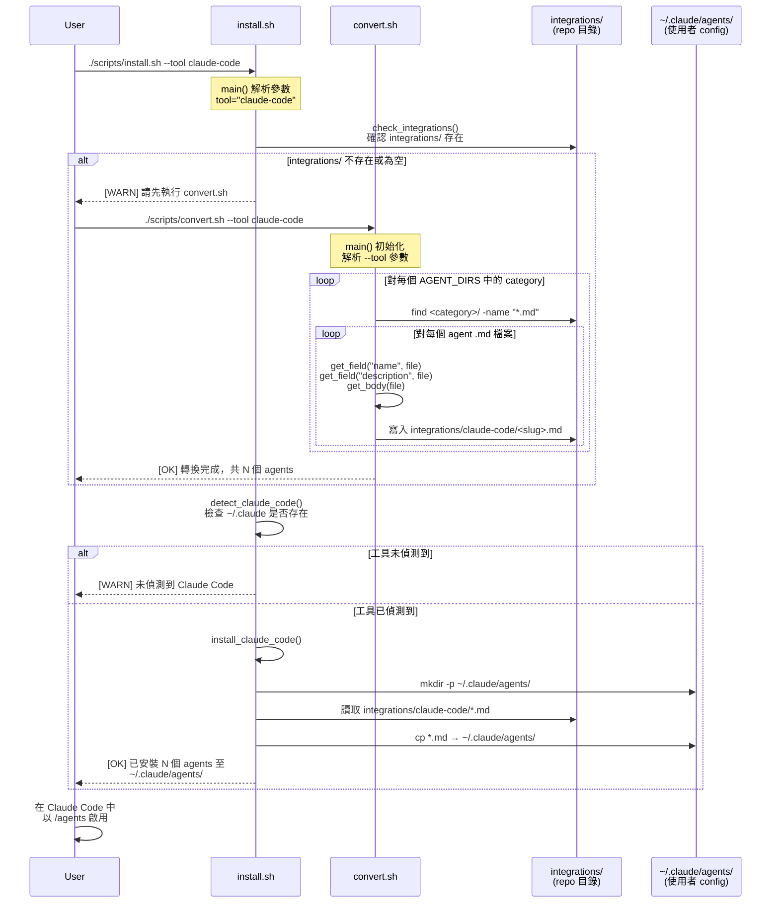

# ARCHITECTURE.md — The Agency 系統架構文件

> 文件日期：2026-04-30
> 專案版本：main branch（github.com/msitarzewski/agency-agents）

---

## 1. 概覽

**The Agency** 是一個 **Content Repository + Bash Toolchain** 架構。其核心資產是以 Markdown 撰寫的 AI agent 定義檔案，搭配三支 Bash 腳本構成完整的格式轉換（convert）、安裝部署（install）、品質驗證（lint）管線。整個系統不含任何傳統程式語言（Python/JS/Go），無網路通訊，純粹在本地端的 shell 環境中運作。

**設計目標**：讓任何人只需新增一個 `.md` 檔案，即可將一個 AI agent 無縫分發至 11 種 AI 工具平台，無需理解各工具的格式細節。

---

## 2. 高層架構圖

```mermaid
flowchart TD
    subgraph Sources["Agent Source Layer（Markdown + YAML Frontmatter）"]
        direction LR
        A1["academic/"]
        A2["engineering/"]
        A3["design/"]
        A4["marketing/"]
        A5["specialized/"]
        A6["strategy/"]
        A7["...（共 14 個 category）"]
    end

    subgraph Toolchain["Toolchain Layer（Bash Scripts）"]
        direction TB
        L["scripts/lint-agents.sh<br/>格式驗證 + CI 守門"]
        C["scripts/convert.sh<br/>格式轉換 → integrations/"]
        I["scripts/install.sh<br/>部署到工具 config 目錄"]
        L --> C
        C --> I
    end

    subgraph Integrations["Integration Layer（生成產物，git ignored）"]
        direction LR
        T1["integrations/claude-code/"]
        T2["integrations/cursor/"]
        T3["integrations/antigravity/"]
        T4["integrations/openclaw/"]
        T5["integrations/kimi/"]
        T6["integrations/...（共 11 種格式）"]
    end

    subgraph Targets["Target Layer（AI 工具 Config 目錄）"]
        direction LR
        D1["~/.claude/agents/"]
        D2[".cursor/rules/"]
        D3["~/.gemini/antigravity/skills/"]
        D4["~/.openclaw/agency-agents/"]
        D5["~/.config/kimi/agents/"]
        D6["...（共 11 個目標）"]
    end

    subgraph CI["CI/CD Layer"]
        GH[".github/workflows/lint-agents.yml<br/>PR 觸發 lint 驗證"]
    end

    Sources --> Toolchain
    Toolchain --> Integrations
    Integrations --> Targets
    Sources -.->|"PR 修改 .md"| CI
    CI -.->|"lint 失敗則阻擋 merge"| Sources
```



---

## 3. 元件清單

### 3.1 Agent Source Layer

| 元件 | 職責 | 關鍵路徑 | 上游依賴 | 下游依賴 |
|------|------|---------|---------|---------|
| Agent `.md` 檔案 | 以 YAML frontmatter + Markdown body 定義 AI agent 的人格與能力 | `<category>/<slug>.md` | 人工撰寫 | convert.sh、lint-agents.sh |
| `AGENT_DIRS` 陣列 | 宣告哪些目錄是合法的 agent category，三支腳本共用（⚠️ 須手動同步） | convert.sh:64、install.sh:107、lint-agents.sh:12 | 無 | 全部 toolchain |

**Agent 檔案雙層結構**：

```
┌─────────────────────────────────────┐
│  YAML Frontmatter（機器可讀 metadata）│
│  name, description, color, emoji,   │
│  vibe, services（選填）              │
├─────────────────────────────────────┤
│  Markdown Body（AI system prompt）   │
│  ## Identity & Memory（SOUL）        │
│  ## Core Mission（AGENTS）           │
│  ## Critical Rules（SOUL）           │
│  ## Technical Deliverables（AGENTS）│
│  ## Workflow Process（AGENTS）       │
│  ## Communication Style（SOUL）      │
│  ## Success Metrics（AGENTS）        │
└─────────────────────────────────────┘
```

必填欄位：`name`、`description`、`color`

### 3.2 Toolchain Layer

| 元件 | 職責 | 關鍵路徑 | 主要函式 |
|------|------|---------|---------|
| `convert.sh` | 掃描所有 agent `.md` 並輸出工具特定格式至 `integrations/` | `scripts/convert.sh` | `get_field()`、`get_body()`、`slugify()`、`convert_<tool>()`、`run_conversions()` |
| `install.sh` | 偵測已安裝工具，將 `integrations/` 的產物複製到各工具 config 目錄 | `scripts/install.sh` | `detect_<tool>()`、`install_<tool>()`、`interactive_select()`、`check_integrations()` |
| `lint-agents.sh` | 驗證 agent 檔案格式正確性，回傳 exit 1 若有 error | `scripts/lint-agents.sh` | `lint_file()`、`classify_header_target()` |

### 3.3 Integration Layer（生成產物）

| 元件 | 輸出格式 | 輸出模式 | 目標工具 |
|------|---------|---------|---------|
| `antigravity/` | 每 agent 一個 `SKILL.md`（含 date_added） | per-agent | Antigravity / Gemini |
| `gemini-cli/` | `SKILL.md` + `gemini-extension.json` manifest | per-agent + manifest | Gemini CLI |
| `opencode/` | `.md` 含 `mode: subagent` frontmatter | per-agent | OpenCode |
| `cursor/` | `.mdc` rule 檔案 | per-agent | Cursor |
| `openclaw/` | `SOUL.md` + `AGENTS.md` + `IDENTITY.md` 三檔案 | per-agent（多檔） | OpenClaw |
| `qwen/` | `.md` SubAgent 格式 | per-agent | Qwen Code |
| `kimi/` | `agent.yaml` + `system.md` 兩檔案 | per-agent（多檔） | Kimi Code |
| `aider/` | 單一 `CONVENTIONS.md`（所有 agents 累積） | accumulated | Aider |
| `windsurf/` | 單一 `.windsurfrules`（所有 agents 累積） | accumulated | Windsurf |
| `claude-code/` | `.md` 原生格式（與 source 相同） | per-agent | Claude Code |
| `copilot/` | `.md` 原生格式 | per-agent | GitHub Copilot |

> 注意：`integrations/` 目錄中的生成檔案被 `.gitignore` 排除，只保留各工具的 `README.md` 和 `setup.sh`。

### 3.4 CI/CD Layer

| 元件 | 職責 | 關鍵路徑 | 觸發條件 |
|------|------|---------|---------|
| `lint-agents.yml` | PR 時自動執行 lint，防止格式不合規的 agent 合併 | `.github/workflows/lint-agents.yml` | PR 修改 `<category>/**` 路徑 |
| Issue Templates | 標準化 bug report 與 agent 請求流程 | `.github/ISSUE_TEMPLATE/` | 手動建立 issue |

---

## 4. 分層設計與 Module Boundary

```
Layer 0：Source (agent .md files)
    ↕  唯一介面：YAML frontmatter schema + Markdown section 慣例
Layer 1：Toolchain (Bash scripts)
    ↕  唯一介面：integrations/<tool>/ 目錄結構
Layer 2：Integration Artifacts (generated files)
    ↕  唯一介面：各工具 config 目錄的路徑慣例
Layer 3：Target AI Tools (claude-code, cursor, aider…)
```

**Boundary 規則**：

- **Source → Toolchain**：toolchain 只能透過 `get_field()` / `get_body()` 讀取 agent 檔案，不得假設 body 的具體結構（除 OpenClaw 的 SOUL/AGENTS 分割邏輯外）。
- **Toolchain → Integration**：`convert.sh` 只寫入 `integrations/`，絕不直接修改使用者 config 目錄（職責分離）。
- **Integration → Target**：`install.sh` 只做複製/連結，不做格式轉換。

**唯一的跨層耦合點**：`AGENT_DIRS` 陣列同時出現在三支腳本中（convert.sh:64、install.sh:107、lint-agents.sh:12），目前沒有 DRY 機制，是已知技術債。

---

## 5. 通訊模式

此系統為純 Bash toolchain，**無任何網路通訊**。所有資料流均為本地端 file I/O 與 shell pipe：

| 模式 | 說明 | 實作位置 |
|------|------|---------|
| **Pipeline（Unix Pipe）** | `find → get_field → get_body → convert_<tool> → write` | `run_conversions()` |
| **Strategy（工具 dispatch）** | `case "$tool"` 語句 dispatch 到對應的 `convert_<tool>()` | `convert.sh:501-510` |
| **Accumulator** | Aider/Windsurf 全部 agents 寫入同一 temp file，最後 flush | `convert.sh` Aider/Windsurf 區段 |
| **Environment Variable IPC** | 並行模式下父程序以 env var 傳遞路徑與旗標給子程序 | `AGENCY_INSTALL_WORKER`、`AGENCY_INSTALL_OUT_DIR` |
| **Interactive TUI** | `install.sh` 在 terminal 環境下呈現 checkbox 選單供使用者選擇工具 | `interactive_select()` |

---

## 6. 關鍵設計決策與 Trade-off

### 決策 1：YAML frontmatter + Markdown body 的雙層格式

**選擇**：使用 Markdown 原生格式而非 JSON/YAML/TOML 設定檔。

**理由**：frontmatter 提供機器可讀的結構化 metadata；body 是純文字的 system prompt，可直接貼入任何 AI 工具，人類易讀易改，天然支援版本控制 diff。

**Trade-off**：`get_field()` 使用 AWK 手工解析 YAML（`scripts/convert.sh:87-93`），只支援 flat `key: value` 格式。複雜 YAML 結構（如 `services` 的巢狀陣列）目前不被任何轉換函式使用，僅作文件性聲明。

### 決策 2：Persona / Operations 分割（SOUL vs AGENTS）

**選擇**：將 agent body 依 section 關鍵字分成 SOUL.md（人格）與 AGENTS.md（能力）兩個語義單元。

**實作**：`classify_header_target()` 在 `scripts/lint-agents.sh:38-53` 與 `convert_openclaw()` 在 `scripts/convert.sh:286-313` 均實作了相同分類邏輯（鏡像實作）。

**理由**：讓 OpenClaw 等工具可以獨立載入人格層或能力層，支援更細粒度的 agent 組合。

**Trade-off**：分類邏輯重複出現在兩支腳本中，若規則變更需同步修改兩處。

### 決策 3：integrations/ 全部 git ignored（生成產物不入版控）

**選擇**：`.gitignore` 排除所有 `convert.sh` 生成的檔案。

**理由**：避免 PR 中出現大量機器生成的 diff noise，保持 repo 乾淨；格式可以隨時從 source 重新生成。

**Trade-off**：新 clone 的 repo 需先執行 `./scripts/convert.sh` 才能使用大多數工具，不如「開箱即用」來得方便。

### 決策 4：三支獨立腳本而非單一 CLI

**選擇**：convert / install / lint 三個關注點分離為三支腳本。

**理由**：符合 Unix single-responsibility 原則；CI 只需執行 lint，使用者可分步執行 convert → install，也可在 CI 環境跳過 install。

**Trade-off**：`AGENT_DIRS` 陣列在三支腳本中各自維護，需手動保持一致（已知技術債，見 `extensions.md`）。

### 決策 5：Accumulator Pattern（Aider / Windsurf）

**選擇**：Aider 和 Windsurf 使用單一輸出檔案模式（所有 agents 合併）。

**理由**：這兩個工具不支援多 agent 檔案，只能接受單一 conventions/rules 檔案。

**Trade-off**：無法選擇性安裝單個 agent，每次都是全量替換。

---

## 7. Agent 安裝流程 Sequence Diagram

以下展示從使用者執行 `./scripts/install.sh --tool claude-code` 到 agents 實際安裝完成的完整流程：



---

## 8. 擴充點摘要

| 擴充目標 | 所需修改 | 難度 |
|----------|----------|------|
| 新增單個 agent | 在 category 目錄新增 1 個 `.md` 檔 | 極易 |
| 新增 agent category | 修改 3 支腳本的 `AGENT_DIRS` + CI `paths` 設定 | 易 |
| 新增工具支援（per-agent 輸出） | 在 convert.sh 新增 `convert_<tool>()`，在 install.sh 新增 `detect_<tool>()` + `install_<tool>()` | 中 |
| 新增工具支援（accumulated 輸出） | 同上，並額外實作 accumulator 邏輯與 flush 呼叫 | 中上 |

**自動發現機制**：`run_conversions()` 使用 `find "$dirpath" -name "*.md" -type f` 遞迴掃描，新增 `.md` 檔案後無需修改任何設定即可自動被 toolchain 處理。`game-development/` 的多層子目錄（`unity/`、`godot/` 等）即是此機制的實際應用。

---

## 9. 關鍵檔案索引

| 檔案 | 用途 |
|------|------|
| `scripts/convert.sh` | 格式轉換主腳本；`get_field()`、`get_body()`、`slugify()` 核心函式 |
| `scripts/install.sh` | 安裝部署腳本；`detect_<tool>()`、`install_<tool>()` 工具介面 |
| `scripts/lint-agents.sh` | 格式驗證腳本；`lint_file()`、`classify_header_target()` |
| `.github/workflows/lint-agents.yml` | CI 守門，PR 自動觸發 lint |
| `integrations/*/README.md` | 各工具整合說明（唯一入版控的 integrations 檔案） |
| `integrations/mcp-memory/setup.sh` | MCP 記憶整合骨架（⚠️ 佔位符，需自行選擇 MCP server） |
| `examples/nexus-spatial-discovery.md` | 8 個 agents 協作的完整範例（NEXUS 框架） |
| `strategy/` | NEXUS 協調框架定義（⚠️ 未出現在 README 分部清單） |
| `scripts/i18n/localize-agents-zh.ps1` | Windows PowerShell 中文本地化腳本 |
