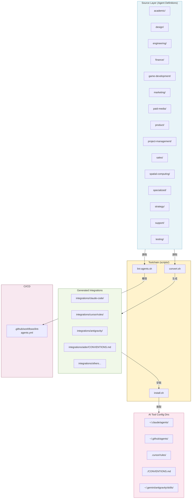

# Codebase Map — 程式碼地圖

## Annotated Directory Tree

```
agency-agents/                         # 專案根目錄
│
├── 📄 README.md                       # [主要入口] 完整 agent roster + 使用說明 + 整合文件
├── 📄 CONTRIBUTING.md                 # [貢獻者指南] Agent 設計規範、PR 流程、Style Guide
├── 📄 CONTRIBUTING_zh-CN.md          # 簡體中文貢獻指南
├── 📄 SECURITY.md                     # 安全政策
├── 📄 LICENSE                         # MIT License
├── 📄 .gitignore                      # 排除 generated integrations 檔案
│
├── 🤖 academic/                       # [分部] 學術 — 人類學、地理、歷史、敘事學、心理學
│   └── academic-*.md
│
├── 🤖 design/                         # [分部] 設計 — UI、UX、品牌、視覺、包容性視覺
│   └── design-*.md
│
├── 🤖 engineering/                    # [分部] 工程 — 前端、後端、DevOps、AI、安全、SRE 等
│   └── engineering-*.md
│
├── 🤖 finance/                        # [分部] 財務 — 記帳、財務分析、FP&A、投資研究、稅務
│   └── finance-*.md
│
├── 🤖 game-development/               # [分部] 遊戲開發 — 引擎無關 + 各引擎專屬
│   ├── game-designer.md               # 引擎無關類
│   ├── level-designer.md
│   ├── unity/                         # Unity 專屬子目錄
│   │   └── unity-*.md
│   ├── unreal-engine/                 # Unreal Engine 專屬子目錄
│   │   └── unreal-*.md
│   ├── godot/                         # Godot 專屬子目錄
│   │   └── godot-*.md
│   ├── blender/                       # Blender 專屬子目錄
│   │   └── blender-*.md
│   └── roblox-studio/                 # Roblox Studio 專屬子目錄
│       └── roblox-*.md
│
├── 🤖 marketing/                      # [分部] 行銷 — 社媒、SEO、內容、中國市場、直播帶貨等
│   └── marketing-*.md
│
├── 🤖 paid-media/                     # [分部] 付費媒體 — PPC、搜尋查詢、程序化廣告
│   └── paid-media-*.md
│
├── 🤖 product/                        # [分部] 產品 — PM、Sprint 規劃、用戶回饋、行為設計
│   └── product-*.md
│
├── 🤖 project-management/             # [分部] 專案管理 — Studio 製作人、Project Shepherd 等
│   └── project-management-*.md
│
├── 🤖 sales/                          # [分部] 銷售 — Deal Strategist、Discovery Coach 等
│   └── sales-*.md
│
├── 🤖 spatial-computing/              # [分部] 空間運算 — XR、visionOS、WebXR、Metal
│   └── *.md
│
├── 🤖 specialized/                    # [分部] 特殊 — 跨領域、MCP Builder、合規、法律 等
│   └── *.md
│
├── 📋 strategy/                       # [分部] 策略 — NEXUS 框架文件（不含傳統 agents）
│   ├── EXECUTIVE-BRIEF.md             # NEXUS 高層簡報（戰略摘要）
│   ├── QUICKSTART.md                  # NEXUS 快速啟動指南（5 分鐘上手）
│   ├── nexus-strategy.md
│   ├── coordination/                  # Agent 協調範本
│   │   ├── agent-activation-prompts.md
│   │   └── handoff-templates.md
│   ├── playbooks/                     # 場景化執行劇本
│   │   ├── scenario-enterprise-feature.md
│   │   ├── scenario-incident-response.md
│   │   ├── scenario-marketing-campaign.md
│   │   └── scenario-startup-mvp.md
│   └── runbooks/                      # 分相執行手冊
│       ├── phase-0-discovery.md 到 phase-6-operate.md
│
├── 🤖 support/                        # [分部] 支援 — 客服、分析、財務追蹤、基礎設施
│   └── support-*.md
│
├── 🤖 testing/                        # [分部] 測試 — QA、效能測試、API 測試、無障礙稽核
│   └── testing-*.md
│
├── 🔧 scripts/                        # [Toolchain] 核心工具腳本
│   ├── convert.sh                     # [主要] 格式轉換 — 讀取 agents，輸出各工具格式
│   ├── install.sh                     # [主要] 安裝器 — 複製到各工具 config 目錄
│   ├── lint-agents.sh                 # [品質] Agent 格式驗證
│   └── i18n/
│       ├── agent-names-zh.json        # zh-CN 名稱對照表（JSON）
│       └── localize-agents-zh.ps1     # Windows PowerShell 本地化腳本
│
├── 📦 integrations/                   # [整合] 各工具的 README + 生成檔案（大部分 gitignored）
│   ├── claude-code/README.md          # Claude Code 整合說明
│   ├── github-copilot/README.md       # GitHub Copilot 整合說明
│   ├── antigravity/README.md          # Antigravity 整合說明
│   ├── gemini-cli/README.md           # Gemini CLI 整合說明
│   ├── opencode/README.md             # OpenCode 整合說明
│   ├── cursor/README.md               # Cursor 整合說明
│   ├── aider/README.md                # Aider 整合說明
│   ├── windsurf/README.md             # Windsurf 整合說明
│   ├── openclaw/README.md             # OpenClaw 整合說明
│   ├── qwen/README.md                 # Qwen Code 整合說明
│   ├── kimi/README.md                 # Kimi Code 整合說明
│   └── mcp-memory/                    # MCP Memory 整合
│       ├── setup.sh                   # MCP server 設定腳本（骨架）
│       ├── README.md
│       └── backend-architect-with-memory.md  # 示範性 agent
│
├── 📚 examples/                       # [範例] 多 agent 協作工作流程
│   ├── README.md                      # 範例索引
│   ├── nexus-spatial-discovery.md     # [旗艦範例] 8 agents 並行 × 10 分鐘完整產品探索
│   ├── workflow-book-chapter.md       # 撰寫書章工作流程
│   ├── workflow-landing-page.md       # 登錄頁設計工作流程
│   ├── workflow-startup-mvp.md        # Startup MVP 工作流程
│   └── workflow-with-memory.md        # 跨 session 記憶工作流程
│
└── ⚙️ .github/                        # [CI/CD] GitHub 設定
    ├── workflows/
    │   └── lint-agents.yml            # PR 自動 lint（只驗證被修改的 agent 檔案）
    ├── ISSUE_TEMPLATE/
    │   ├── bug-report.yml
    │   └── new-agent-request.yml
    ├── PULL_REQUEST_TEMPLATE.md
    └── FUNDING.yml
```

---

## 「我想改 X 要看哪裡？」速查表

| 我想要… | 看這裡 | 關鍵檔案 |
|---------|--------|----------|
| 新增一個 agent | 對應 category 目錄 | 複製一個現有 `.md` 修改 |
| 修改現有 agent 的行為 | 對應 category 目錄 | 找到 `category/agent-name.md` |
| 新增一個 agent category | 3 個腳本 + CI config | `scripts/convert.sh:64`, `scripts/install.sh:107`, `scripts/lint-agents.sh:12`, `.github/workflows/lint-agents.yml` |
| 新增對新 AI 工具的支援 | 2 個腳本 + 新 README | `scripts/convert.sh` (`convert_<tool>()`) + `scripts/install.sh` (`detect_<tool>()`, `install_<tool>()`) + `integrations/<tool>/README.md` |
| 修改 agent frontmatter 必填欄位 | lint 腳本 | `scripts/lint-agents.sh:30` (`REQUIRED_FRONTMATTER`) |
| 修改 agent 推薦 section | lint 腳本 | `scripts/lint-agents.sh:31` (`RECOMMENDED_SECTIONS`) |
| 修改 SOUL/AGENTS 分類邏輯 | 2 個腳本（需同步） | `scripts/convert.sh:286-300` + `scripts/lint-agents.sh:38-53` |
| 修改 OpenCode 顏色映射 | convert 腳本 | `scripts/convert.sh:158-200` (`resolve_opencode_color()`) |
| 修改 NEXUS 多 agent 協調框架 | strategy 目錄 | `strategy/QUICKSTART.md`, `strategy/coordination/`, `strategy/playbooks/` |
| 新增 zh-CN 翻譯對照 | i18n 目錄 | `scripts/i18n/agent-names-zh.json` |
| 修改 CI lint 觸發條件 | GitHub Actions | `.github/workflows/lint-agents.yml` |
| 新增 multi-agent 工作流程範例 | examples 目錄 | `examples/` 新增 `.md` 檔案 |
| 讓新 agent 支援 MCP memory | mcp-memory 整合 | `integrations/mcp-memory/` 參考 `backend-architect-with-memory.md` |

---

## 模組依賴關係圖



---

## 關鍵檔案速查

| 檔案 | 行數 | 用途 |
|------|------|------|
| `scripts/convert.sh` | 640 行 | 最核心的工具：frontmatter 解析、格式轉換、並行化 |
| `scripts/install.sh` | 665 行 | 工具偵測、互動 UI、安裝邏輯 |
| `scripts/lint-agents.sh` | 143 行 | Agent 格式驗證 |
| `README.md` | 921 行 | 完整的專案文件和 agent roster |
| `CONTRIBUTING.md` | 429 行 | 設計規範和貢獻流程 |
| `strategy/EXECUTIVE-BRIEF.md` | — | NEXUS 戰略框架說明 |
| `strategy/QUICKSTART.md` | — | NEXUS 快速上手指南 |
| `examples/nexus-spatial-discovery.md` | — | 旗艦多 agent 協作範例 |
