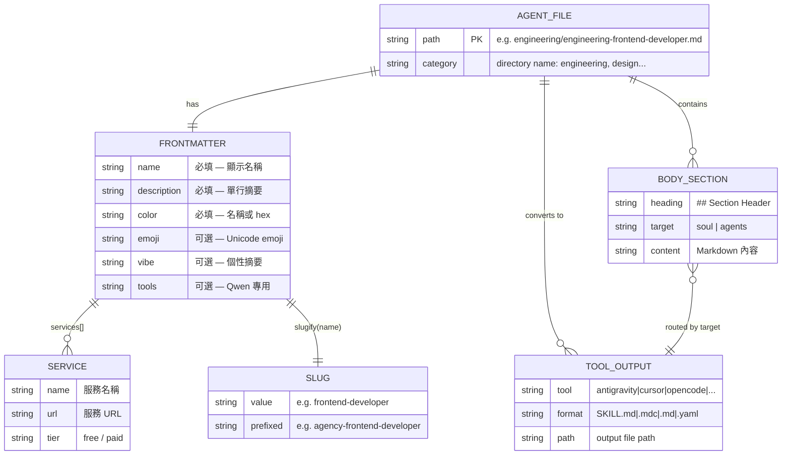
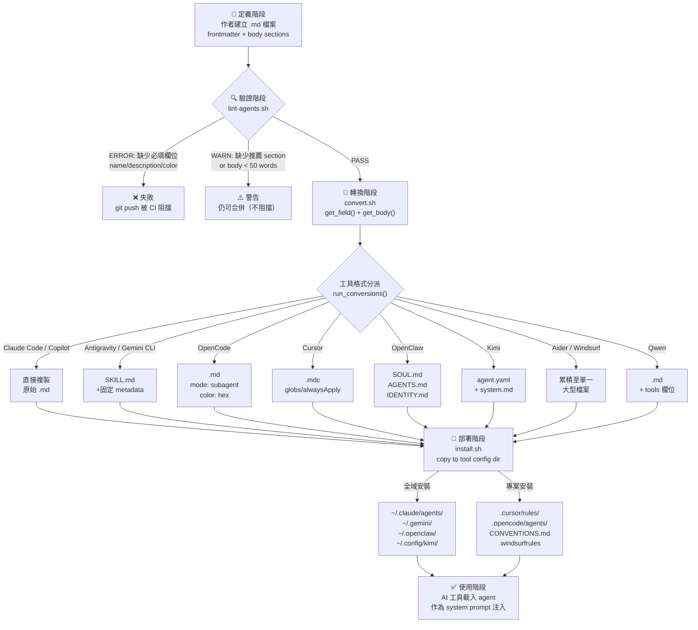

# DATA_MODEL.md — 資料模型文件

> **重要前提**：本專案不使用任何資料庫。「資料模型」指的是 agent `.md` 定義檔案的結構規範，以及這些結構如何被腳本解析、轉換與部署。

---

## 目錄

1. [核心資料結構概覽](#1-核心資料結構概覽)
2. [Frontmatter 欄位完整說明](#2-frontmatter-欄位完整說明)
3. [Agent Body 語義分類](#3-agent-body-語義分類)
4. [各工具輸出格式的 Output Schema](#4-各工具輸出格式的-output-schema)
5. [Mermaid ER Diagram](#5-mermaid-er-diagram)
6. [Agent 生命週期](#6-agent-生命週期)

---

## 1. 核心資料結構概覽

每個 agent 是一個純文字 `.md` 檔案，由「機器可讀層」與「人類可讀層」組成的雙層結構：

```
┌────────────────────────────────────────────┐
│  Layer 1: YAML Frontmatter（機器可讀）      │
│  ─────────────────────────────────────────  │
│  name:        string  (必填)               │
│  description: string  (必填)               │
│  color:       string  (必填)               │
│  emoji:       string  (可選)               │
│  vibe:        string  (可選)               │
│  services:    list    (可選)               │
├────────────────────────────────────────────┤
│  Layer 2: Markdown Body（人類可讀 + AI）    │
│  ─────────────────────────────────────────  │
│  ## 🧠 Identity & Memory     → SOUL        │
│  ## 🎯 Core Mission          → AGENTS      │
│  ## 🚨 Critical Rules        → SOUL        │
│  ## 📋 Technical Deliverables→ AGENTS      │
│  ## 🔄 Workflow Process      → AGENTS      │
│  ## 💭 Communication Style   → SOUL        │
│  ## 🔄 Learning & Memory     → SOUL        │
│  ## 🎯 Success Metrics       → AGENTS      │
│  ## 🚀 Advanced Capabilities → AGENTS      │
└────────────────────────────────────────────┘
```

**設計哲學**：Frontmatter 讓工具可以程式化處理（排序、顏色渲染、slug 生成），Body 是純文字 system prompt，讓人類可讀、可修改、可版本控制，同時作為 AI 的行為指令注入。

---

## 2. Frontmatter 欄位完整說明

### 2.1 必填欄位

| 欄位 | 型別 | 說明 | 範例值 |
|------|------|------|--------|
| `name` | `string` | Agent 的顯示名稱，用於 UI 呈現與識別 | `"Frontend Developer"` |
| `description` | `string` | 單行功能描述，各工具整合時作為摘要顯示 | `"Expert frontend developer..."` |
| `color` | `string` | 顏色識別，接受顏色名稱或 hex code | `"cyan"` 或 `"#D97706"` |

**驗證邏輯**（`scripts/lint-agents.sh`）：缺少任何必填欄位會觸發 `ERROR`，導致 lint 失敗。

### 2.2 可選欄位

| 欄位 | 型別 | 說明 | 範例值 |
|------|------|------|--------|
| `emoji` | `string` | 單一 Unicode emoji，用於視覺辨識 | `"🖥️"` |
| `vibe` | `string` | 一句話個性摘要，供 OpenClaw `IDENTITY.md` 使用 | `"Builds responsive, accessible web apps..."` |
| `services` | `list[Service]` | 外部服務依賴清單，只有 agent 需要呼叫外部 API 時才填 | 見下方 |
| `tools` | `string` | 工具清單（Qwen Code 專用欄位） | `"code_interpreter,web_search"` |

### 2.3 `services` 欄位結構（可選，巢狀物件）

`services` 是唯一的多行 YAML block 欄位，`get_field()` 函式（`scripts/convert.sh:87-93`）不支援解析巢狀結構，此欄位目前只通過 lint 驗證但不被轉換腳本使用。

```yaml
services:
  - name: Gemini API
    url: https://aistudio.google.com/app/apikey
    tier: free
  - name: Upload-Post
    url: https://upload-post.com
    tier: free
```

| 子欄位 | 型別 | 說明 |
|--------|------|------|
| `name` | `string` | 服務名稱 |
| `url` | `string` | 服務 URL |
| `tier` | `string` | 服務定價層級（如 `free`, `paid`） |

**範例來源**：`marketing/marketing-carousel-growth-engine.md`（含 Gemini API 與 Upload-Post 兩個服務）

### 2.4 `color` 欄位的接受值

`color` 欄位接受兩種格式：

- **顏色名稱**（`scripts/convert.sh:159-200` 的 `resolve_opencode_color()` 中定義）：`cyan`, `blue`, `purple`, `green`, `yellow`, `orange`, `red`, `pink`, `indigo`, `teal`, `gray` 等
- **Hex code**：`#RRGGBB` 格式，如 `"#D97706"`, `"#FF0050"`

OpenCode 只接受 hex 格式，轉換時會透過 `resolve_opencode_color()` 將名稱轉換；其他工具直接使用原始字串。未知顏色回退值：`#6B7280`（灰色）。

---

## 3. Agent Body 語義分類

Body 是 frontmatter 結束符（第二個 `---`）之後的所有 Markdown 內容，由 `get_body()`（`scripts/convert.sh:96-99`）提取。

### 3.1 SOUL vs AGENTS 分類規則

`classify_header_target()` 函式（`scripts/lint-agents.sh:38-53`）根據 `## header` 的關鍵字將 section 分為兩類。此邏輯與 `convert_openclaw()`（`scripts/convert.sh:286-313`）保持同步。

**SOUL — 人格層（「誰是這個 agent」）**

匹配規則（正則或關鍵字）：

| 關鍵字模式 | 對應 Section 範例 |
|-----------|------------------|
| `identity` | `## 🧠 Your Identity & Memory` |
| `learning.*memory` | `## 🔄 Learning & Memory` |
| `communication` | `## 💭 Your Communication Style` |
| `style` | `## 💭 Communication Style` |
| `critical.rule` | `## 🚨 Critical Rules` |
| `rules.you.must.follow` | `## Rules You Must Follow` |

**AGENTS — 操作層（「agent 做什麼」）**

不符合 SOUL 規則的所有其他 `##` headers：

| Section 範例 | 說明 |
|-------------|------|
| `## 🎯 Your Core Mission` | 核心職責定義 |
| `## 📋 Your Technical Deliverables` | 具體輸出物 |
| `## 🔄 Your Workflow Process` | 執行步驟 |
| `## 🎯 Your Success Metrics` | 可量化成功標準 |
| `## 🚀 Advanced Capabilities` | 進階功能 |

### 3.2 推薦 Section（Lint WARN 級別）

`RECOMMENDED_SECTIONS`（`scripts/lint-agents.sh:28`）：缺少時觸發 `WARN`（不阻擋 CI）：

```
- Identity
- Core Mission
- Critical Rules
```

### 3.3 Body 長度要求

Body 字數少於 50 個 word 時，lint 觸發 `WARN: very short`。

---

## 4. 各工具輸出格式的 Output Schema

每個工具的 `convert_<tool>()` 函式（`scripts/convert.sh`）將原始 agent 定義轉換為工具特定格式。

### 4.1 Claude Code（原生格式，無需轉換）

```
輸出路徑：~/.claude/agents/<filename>.md
格式：直接複製原始 .md 檔案
```

Claude Code 直接讀取 `.md` 格式，`install_claude_code()`（`scripts/install.sh:305-319`）只執行檔案複製。

### 4.2 GitHub Copilot（原生格式，無需轉換）

```
輸出路徑：~/.github/agents/<filename>.md
          ~/.copilot/agents/<filename>.md
格式：直接複製原始 .md 檔案
```

### 4.3 Antigravity / Gemini Skills

```
輸出路徑：integrations/antigravity/agency-<slug>/SKILL.md
函式：convert_antigravity()（scripts/convert.sh:109-132）
```

**Output schema**：

```yaml
---
name: agency-<slug>           # "agency-" 前綴 + slugify(name)
description: <description>    # 原始 description
risk: low                     # 固定值
source: community             # 固定值
date_added: 'YYYY-MM-DD'      # 執行 convert.sh 的日期
---
<agent body>
```

### 4.4 Gemini CLI Skills

```
輸出路徑：integrations/gemini-cli/skills/<slug>/SKILL.md
函式：convert_gemini_cli()（scripts/convert.sh:134-155）
```

**Output schema**：

```yaml
---
name: <slug>                  # slugify(name)
description: <description>
---
<agent body>
```

### 4.5 OpenCode

```
輸出路徑：integrations/opencode/agents/<slug>.md
函式：convert_opencode()（scripts/convert.sh:202-226）
```

**Output schema**：

```yaml
---
name: <name>                  # 原始 name（非 slug）
description: <description>
mode: subagent                # 固定值
color: '#<RRGGBB>'            # resolve_opencode_color() 後的 hex
---
<agent body>
```

### 4.6 Cursor

```
輸出路徑：integrations/cursor/rules/<slug>.mdc
函式：convert_cursor()（scripts/convert.sh:228-248）
```

**Output schema**：

```yaml
---
description: <description>
globs: ""                     # 固定值（空字串）
alwaysApply: false            # 固定值
---
<agent body>
```

### 4.7 OpenClaw（最複雜，三檔案格式）

```
輸出路徑：integrations/openclaw/<slug>/SOUL.md
          integrations/openclaw/<slug>/AGENTS.md
          integrations/openclaw/<slug>/IDENTITY.md
函式：convert_openclaw()（scripts/convert.sh:251-341）
```

**SOUL.md schema**：

```markdown
# <name>
<SOUL 分類的 sections>
```

**AGENTS.md schema**：

```markdown
# <name>
<AGENTS 分類的 sections>
```

**IDENTITY.md schema**：

```
<emoji> <name>
<vibe>
```

若 `emoji` 或 `vibe` 不存在，對應行省略。

### 4.8 Qwen Code

```
輸出路徑：integrations/qwen/agents/<slug>.md
函式：convert_qwen()（scripts/convert.sh:343-376）
```

**Output schema（有 tools 欄位時）**：

```yaml
---
name: <slug>
description: <description>
tools: <tools>                # 僅當來源有 tools 欄位時才輸出
---
<agent body>
```

### 4.9 Kimi Code（雙檔案格式）

```
輸出路徑：integrations/kimi/<slug>/agent.yaml
          integrations/kimi/<slug>/system.md
函式：convert_kimi()（scripts/convert.sh:378-410）
```

**agent.yaml schema**：

```yaml
version: 1
agent:
  name: <slug>
  extend: default             # 固定值，繼承 Kimi 預設工具集
  system_prompt_path: ./system.md
```

**system.md schema**：

```markdown
# <name>

<description>

<agent body>
```

### 4.10 Aider（Accumulation 格式）

```
輸出路徑：integrations/aider/CONVENTIONS.md
函式：accumulate_aider()（scripts/convert.sh:441-459）
模式：所有 agents 累積至單一檔案
```

每個 agent 的貢獻區塊：

```markdown
---

## <name>

> <description>

<agent body>
```

### 4.11 Windsurf（Accumulation 格式）

```
輸出路徑：integrations/windsurf/.windsurfrules
函式：accumulate_windsurf()（scripts/convert.sh:461-479）
模式：所有 agents 累積至單一檔案
```

每個 agent 的貢獻區塊：

```
================================================================================
## <name>
<description>
================================================================================

<agent body>

```

---

## 5. Mermaid ER Diagram



---

## 6. Agent 生命週期



### 生命週期各階段說明

| 階段 | 工具 | 關鍵函式 | 輸出 |
|------|------|---------|------|
| **定義** | 手動編輯 | — | `.md` 原始檔案 |
| **驗證** | `lint-agents.sh` | `classify_header_target()` | PASS / WARN / ERROR |
| **轉換** | `convert.sh` | `get_field()`, `get_body()`, `slugify()`, `convert_<tool>()` | 各工具格式檔案 |
| **部署** | `install.sh` | `install_<tool>()` | 工具 config 目錄 |
| **使用** | AI 工具（Claude/Cursor 等） | — | Agent 作為 system prompt |

### 轉換核心函式速查

| 函式 | 檔案位置 | 用途 |
|------|---------|------|
| `get_field(field, file)` | `scripts/convert.sh:87` | AWK 解析 frontmatter 單一欄位 |
| `get_body(file)` | `scripts/convert.sh:96` | 提取第二個 `---` 之後的所有內容 |
| `slugify(string)` | `scripts/convert.sh:103` | 名稱正規化 → lowercase + hyphen |
| `resolve_opencode_color(color)` | `scripts/convert.sh:159` | 顏色名稱 → `#RRGGBB` hex |
| `classify_header_target(header)` | `scripts/lint-agents.sh:38` | 判斷 section 歸屬 soul/agents |
| `run_conversions()` | `scripts/convert.sh:483` | 格式篩選與 dispatch 到各轉換函式 |

---

*文件生成日期：2026-04-30*
*資料來源：`scripts/convert.sh`, `scripts/lint-agents.sh`, `scripts/install.sh`, 以及實際 agent 檔案*
