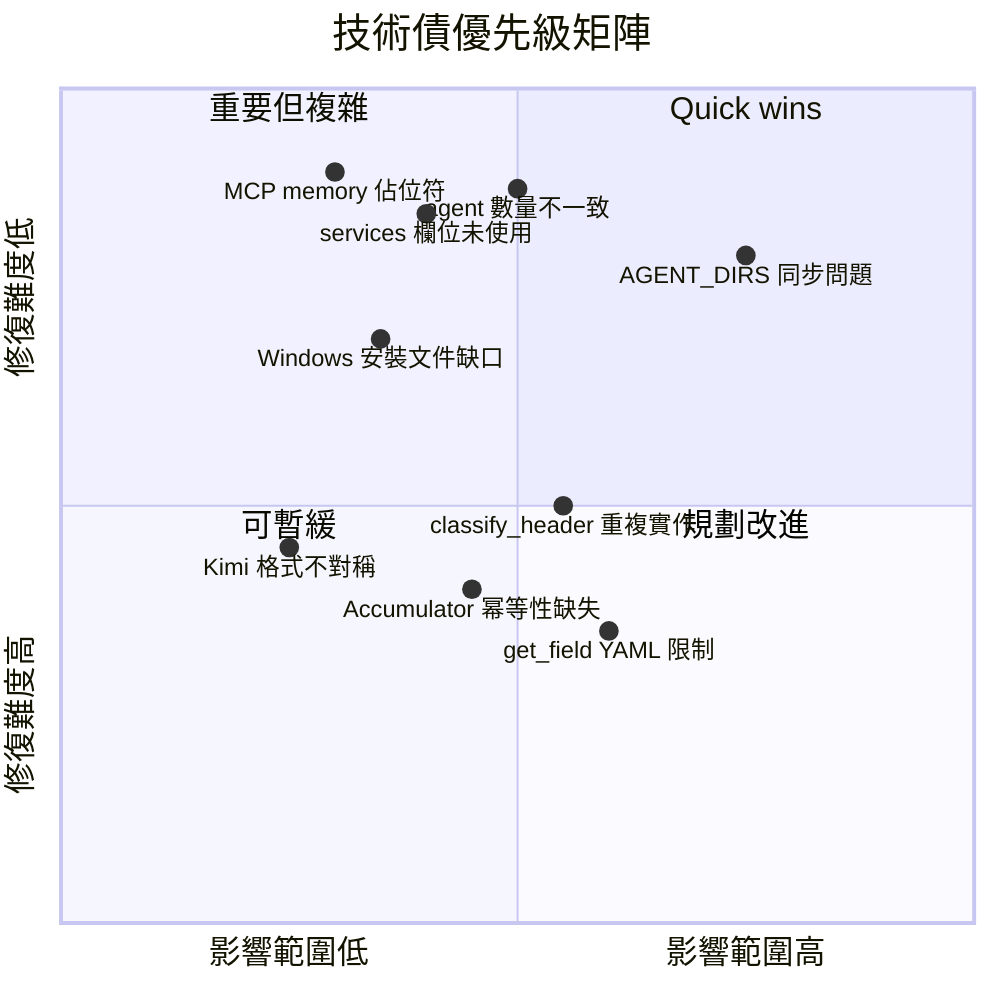

# DISCOVERY_LOG.md — 探索紀錄與待解問題

> 產出日期：2026-04-30
> 資料來源：web_findings.md、recon.md、core_logic.md、程式碼直接掃描

---

## 1. Web Search 發現摘要

### 關鍵 Takeaways

1. **市場時機驅動爆紅**：專案在 Claude Code sub-agents 功能正式推出後迅速走紅，在數天內累積超過 50,000 Stars、7,500+ Forks，定義了 AI agent persona library 的早期生態系標準。

2. **格式即標準**：`.md` + YAML frontmatter 的雙層結構已成為 Claude Code、GitHub Copilot 等工具的原生格式，不需要任何轉換即可直接使用，大幅降低採用門檻。

3. **社群衍生生態**：已有多個社群維護的翻譯 fork（zh-CN）及衍生專案（`awesome-openclaw-agents`），顯示專案已超越單一維護者的控制範圍，正在形成獨立生態系。

4. **定位差異化**：社群普遍把此專案定性為「147 個跨 12 個部門的 specialized AI agents」，而非一般 prompt template 集合，突顯出精心設計的 persona 結構是核心差異。

5. **技術本質釐清**：這不是傳統軟體專案，而是 **AI agent persona library**——每個 `.md` 檔案是一個精心設計的 system prompt，透過輕量 Bash toolchain 部署到各 AI coding assistant。

### 重要連結

| 資源類型 | 連結 |
|----------|------|
| GitHub 倉庫 | https://github.com/msitarzewski/agency-agents |
| GitHub Discussions | https://github.com/msitarzewski/agency-agents/discussions |
| Claude Code Sub-agents 官方文件 | https://code.claude.com/docs/en/sub-agents |
| YUV.AI 介紹文章 | https://yuv.ai/blog/agency-agents |
| zh-CN 翻譯（jnMetaCode） | https://github.com/jnMetaCode/agency-agents-zh |
| awesome-openclaw-agents | https://github.com/mergisi/awesome-openclaw-agents |

---

## 2. 既有文件與程式碼落差清單

1. **Agent 數量不一致**：README Stats 區塊說「144 Specialized Agents」，但同一文件底部致謝區塊說「147 agents across 12 divisions」。實際掃描 `.md` 檔案後約有 226 個，扣除 README、CONTRIBUTING 等非 agent 文件後約落在 144–147 之間。數字來源不明確，無法確認哪個才是正確值。

2. **`strategy/` 分部未列入 CONTRIBUTING.md 清單**：`CONTRIBUTING.md` 的分部清單未包含 `strategy/`，但 `scripts/lint-agents.sh` 第 20 行的 `AGENT_DIRS` 陣列明確包含它。結果是貢獻者依照文件撰寫 agent 時不會知道 `strategy/` 是有效的投放目錄。

3. **`integrations/` 目錄幾乎為空但 README 未說明**：`.gitignore` 排除了所有由 `convert.sh` 生成的整合檔案，新 clone 的 repo 中 `integrations/` 只剩 README.md 和 setup.sh。各工具的 `integrations/*/README.md` 未明確提示「需先執行 `convert.sh` 才能使用」，導致新使用者可能誤以為目錄是空的或專案損壞。位於 `integrations/*/README.md`。

4. **`services` 欄位通過 lint 但無實際作用**：`recon.md` 與 `core_logic.md` 均指出 `services:` frontmatter 欄位可通過 `lint-agents.sh` 驗證，但 `convert.sh` 的 `get_field()` 函式（`scripts/convert.sh:87-93`）只支援 flat key: value，無法解析 YAML 多行 block，因此 `services` 欄位的內容在所有轉換流程中均被靜默忽略。CONTRIBUTING.md 中描述此欄位為有效的 optional field，形成誤導。

5. **MCP memory integration 標示為完整功能但實為佔位符**：`integrations/mcp-memory/` 下的 `setup.sh` 未指定具體的 MCP memory server，要求用戶自行選擇，但 README 中的介紹語氣暗示這是已可使用的整合方案，與實際狀況不符。位於 `integrations/mcp-memory/setup.sh`。

---

## 3. 程式碼中的技術債標記

以下為 `grep -rn "TODO|FIXME|HACK|XXX|⚠️|WORKAROUND"` 的前 20 筆結果（已排除 `.git` 與 `.trace/`）：

| 檔案 | 行號 | 標記內容摘要 |
|------|------|-------------|
| `specialized/legal-document-review.md` | 81 | `MISSING STANDARD TERMS ⚠️`（agent 輸出模板內的警告標記） |
| `specialized/legal-document-review.md` | 140 | `⚠️ Missing Terms: [#]`（佔位符數字未填入） |
| `specialized/legal-document-review.md` | 205 | `⚠️ POTENTIALLY NON-COMPLIANT — Attorney Review Required` |
| `specialized/legal-document-review.md` | 224 | `⚠️ Potentially Non-Compliant: [#]`（佔位符） |
| `specialized/loan-officer-assistant.md` | 168 | `⚠️ DISCLAIMER: This pre-qualification is not a loan commitment` |
| `specialized/loan-officer-assistant.md` | 239 | `⚠️ TRID VIOLATIONS ARE FEDERAL REGULATORY VIOLATIONS` |
| `specialized/loan-officer-assistant.md` | 248 | `LE Delivered: ___ [ ] On time [ ] Late ⚠️` |
| `specialized/loan-officer-assistant.md` | 267 | `CD Delivered: ___ [ ] On time [ ] Late ⚠️` |
| `specialized/hr-onboarding.md` | 199 | `⚠️ Missing this window means waiting until open enrollment` |
| `specialized/hr-onboarding.md` | 200 | `⚠️ Qualifying life events allow mid-year changes` |
| `specialized/retail-customer-returns.md` | 203 | `⚠️ These are internal flags — NEVER accuse a customer directly.` |
| `specialized/legal-client-intake.md` | 262 | `Conflict Status: ✅ Cleared / ⚠️ Pending / ❌ Conflict` |
| `specialized/legal-client-intake.md` | 277 | `⚠️ URGENCY FLAGS` |
| `specialized/real-estate-buyer-seller.md` | 511 | `⚠️ IMPORTANT: Wire Fraud Alert` |
| `specialized/language-translator.md` | 73 | `⚠️ CULTURAL NOTE` |
| `specialized/study-abroad-advisor.md` | 107 | `XXX`（測試分數佔位符：GRE XXX / GMAT XXX / SAT XXXX） |
| `specialized/study-abroad-advisor.md` | 108 | `XXX`（語言成績佔位符：TOEFL XXX / IELTS X.X） |
| `project-management/project-management-project-shepherd.md` | 129 | `## ⚠️ Issues and Risks`（section header） |
| `marketing/marketing-livestream-commerce-coach.md` | 100 | `XXX`（產品差異化文案佔位符） |
| `marketing/marketing-livestream-commerce-coach.md` | 106 | `XXX yuan`（直播定價佔位符） |

**觀察**：大部分 `⚠️` 標記是 agent 輸出模板的警示語，而非程式碼層面的技術債。真正的未完成佔位符集中在 `study-abroad-advisor.md` 和 `marketing-livestream-commerce-coach.md` 的 `XXX` 欄位。

---

## 4. 已知技術債

1. **`AGENT_DIRS` 清單在多處分散定義，容易失同步**
   `scripts/lint-agents.sh` 和 `scripts/convert.sh` 各自維護一份分部目錄清單（`AGENT_DIRS`）。若新增分部，必須同步修改兩個腳本，且目前沒有自動化的一致性驗證。`strategy/` 就是一個曾發生落差的實例（lint 有但文件無）。

2. **`get_field()` 不支援 YAML 嵌套，造成 `services` 欄位靜默失效**
   `scripts/convert.sh:87-93` 的 AWK 解析器只處理 flat `key: value`，遇到多行 block（如 `services:`）直接忽略，不報錯也不警告。這讓任何依賴 `services` 欄位做功能分支的未來功能都無法正常運作，除非重寫解析器。

3. **Accumulator Pattern 在 Aider/Windsurf 轉換中缺乏幂等性保障**
   `convert_aider()` 和 `convert_windsurf()` 使用累積寫入同一個 temp file 再 flush 的策略。若 `convert.sh` 中途中斷後重新執行，舊的 temp file 殘留可能導致內容重複或損壞，目前未見清除機制。

4. **MCP memory integration 是未完成的佔位符，但以完整功能姿態存在**
   `integrations/mcp-memory/setup.sh` 需要使用者自行選擇並安裝 MCP memory server，實際核心功能未實作。此整合以與其他 integrations 同等地位存在於 repo，可能誤導使用者預期。

5. **Kimi integration 使用獨立 `agent.yaml` 格式，轉換邏輯與其他工具不對稱**
   Kimi 的輸出需要 `agent.yaml` + `system.md` 雙檔案格式，且 YAML 結構不同於其他所有工具。此特殊案例增加 `convert.sh` 的維護複雜度，若 Kimi 格式有變動，需要單獨修改。

6. **`classify_header_target()` 邏輯在 `convert.sh` 與 `lint-agents.sh` 中重複實作**
   Persona/Operations 分割邏輯在 `scripts/convert.sh:286-313` 與 `scripts/lint-agents.sh:38-53` 各有一份類似但不完全相同的實作。若日後修改分類規則，需同步更新兩處，否則 lint 結果與轉換輸出會不一致。

---

## 5. 未解答的疑問

1. **`services` 欄位的設計意圖為何？**
   frontmatter 規格允許 `services:` 欄位，但所有轉換腳本都未使用它。這是尚未實作的功能（為未來的「服務感知 agent」預留位置），還是已被放棄的設計？若是前者，應在 CONTRIBUTING.md 明確說明；若是後者，應從規格中移除以免混淆。

2. **`strategy/` 目錄的 agent 是否遵循標準 agent 格式？**
   `strategy/` 包含 NEXUS 框架文件、coordination/、playbooks/、runbooks/ 等子目錄，其內容結構與一般 agent 檔案可能不同。`lint-agents.sh` 是否正確處理這些非標準 agent 檔案？lint 是否會對它們報錯？

3. **並行安裝模式（`AGENCY_INSTALL_WORKER` 環境變數 IPC）的實際效能提升為何？**
   `install.sh` 使用環境變數在父子程序間傳遞狀態，支援並行安裝。但 144+ 個 agent 的安裝瓶頸主要是 file I/O，並行化的實際效益有多大？是否有基準測試數據？

4. **Windows 使用者的完整安裝路徑為何？**
   `scripts/i18n/localize-agents-zh.ps1` 的存在表示有 Windows 環境的使用者，但 `install.sh` 是純 Bash 腳本，在 Windows 上需要 WSL 或 Git Bash。README 對 Windows 使用者的安裝流程沒有明確說明，這可能是一個隱性的支援缺口。

5. **144 vs 147 的確切 agent 數量如何計算？**
   `strategy/` 目錄含有大量非 agent 的 Markdown 文件（QUICKSTART、EXECUTIVE-BRIEF、playbooks 等）。lint 腳本如何區分「真正的 agent 檔案」與「策略文件」？目前是否有明確的判斷標準（如 frontmatter 必要欄位）？

---

## 6. 建議優先調查的區域

1. **`scripts/convert.sh`（整個檔案）**：這是整個 toolchain 的核心，包含所有轉換邏輯。特別關注 `convert_openclaw()`（Persona/Operations 分割）和 `get_field()`（YAML 解析限制）。

2. **`scripts/lint-agents.sh`（第 20 行 `AGENT_DIRS`、第 38-53 行 `classify_header_target()`）**：確認與 `convert.sh` 的一致性，以及對 `strategy/` 子目錄的處理方式。

3. **`strategy/` 目錄結構**：了解 NEXUS 框架文件與標準 agent 的界線，以及 `specialized/agents-orchestrator.md` 如何作為協調 agent 運作。

4. **`integrations/mcp-memory/setup.sh`**：評估實際完成度，決定是完善功能還是在文件中明確標示為 experimental/WIP。

5. **`examples/nexus-spatial-discovery.md`**：作為 8 個 agent 同時協作的完整範例，是了解 multi-agent workflow 實際運作的最佳切入點。

---

## 7. 優先級矩陣



### 矩陣說明

| 象限 | 項目 | 建議行動 |
|------|------|---------|
| **Quick wins**（高影響、易修復） | `AGENT_DIRS` 同步問題、`services` 欄位說明、MCP memory 標示、agent 數量不一致、Windows 文件缺口 | 近期 PR，優先處理 |
| **重要但複雜**（高影響、難修復） | `get_field()` YAML 解析限制 | 需架構討論，規劃重構 |
| **規劃改進**（低影響、難修復） | `classify_header` 重複實作、Accumulator 幂等性、Kimi 格式不對稱 | 列入 backlog，版本迭代時解決 |
| **可暫緩**（低影響、易修復） | — | 目前無明確案例 |
```
